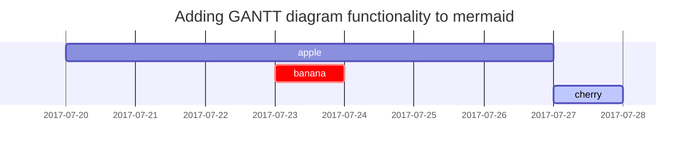

This post is to show Markdown syntax rendering on [**Chirpy**](https://github.com/cotes2020/jekyll-theme-chirpy), you can also use it as an example of writing. Now, let's start looking at text and typography.

# Paragraph

I wandered lonely as a cloud

That floats on high o'er vales and hills,

When all at once I saw a crowd,

A host, of golden daffodils;

Beside the lake, beneath the trees,

Fluttering and dancing in the breeze.

# Nested and mixed lists
Nested and mixed lists are an interesting beast[^1]. It's a corner case to make sure that

* Lists within lists do not break the ordered list numbering order
* Your list styles go deep enough.

## Ordered list

1. Firstly
2. Secondly
3. Thirdly

## Unordered list

- Chapter
  - Section
    - Paragraph

## Task Lists

- [x] Finish my changes
- [ ] Push my commits to GitHub
- [ ] Open a pull request

## Description list

Sun
: the star around which the earth orbits

Moon
: the natural satellite of the earth, visible by reflected light from the sun


# Quote

> Only one thing is impossible for God: To find any sense in any copyright law on the planet.
  
> <cite><a href="http://www.brainyquote.com/quotes/quotes/m/marktwain163473.html">Mark Twain</a></cite>

# Prompts

> An example showing the `tip` type prompt.
{: .prompt-tip }

> An example showing the `info` type prompt.
{: .prompt-info }

> An example showing the `warning` type prompt.
{: .prompt-warning }

> An example showing the `danger` type prompt.
{: .prompt-danger }


# Twitter embedded

<blockquote class="twitter-tweet" data-lang="en"><p lang="en" dir="ltr">🎨 Finally got around to adding all my <a href="https://twitter.com/procreateapp">@procreateapp</a> creations with time lapse videos <a href="https://t.co/1nNbkefC3L">https://t.co/1nNbkefC3L</a> <a href="https://t.co/gcNLJoJ0Gn">pic.twitter.com/gcNLJoJ0Gn</a></p>&mdash; Michael Rose (@mmistakes) <a href="https://twitter.com/mmistakes/status/662678050795094016">November 6, 2015</a></blockquote>
<script async src="//platform.twitter.com/widgets.js" charset="utf-8"></script>

This post tests Twitter Embeds.


# Video embedded

YouTube video embedded below.

<iframe width="640" height="360" src="https://www.youtube.com/embed/fBnAMUkNM2k" frameborder="0" allowfullscreen></iframe>

<center><b>ENGLISH SPEECH | MUNIBA MAZARI - We all are Perfectly Imperfect (English Subtitles)</b></center>

Here is the code:
```
<iframe width="640" height="360" src="https://www.youtube.com/embed/fBnAMUkNM2k" frameborder="0" allowfullscreen></iframe>
```


# Tables

| Header1 | Header2 | Header3 |
|:--------|:-------:|--------:|
| cell1   | cell2   | cell3   |
| cell4   | cell5   | cell6   |
|----
| cell1   | cell2   | cell3   |
| cell4   | cell5   | cell6   |


# Image alignment

Welcome to image alignment! The best way to demonstrate the ebb and flow of the various image positioning options is to nestle them snuggly among an ocean of words. Grab a paddle and let's get started.

]

The image above happens to be **centered**.

{: .left } The rest of this paragraph is filler for the sake of seeing the text wrap around the 150×150 image, which is **left aligned**.

As you can see there should be some space above, below, and to the right of the image. The text should not be creeping on the image. Creeping is just not right. Images need breathing room too. Let them speak like you words. Let them do their jobs without any hassle from the text. In about one more sentence here, we'll see that the text moves from the right of the image down below the image in seamless transition. Again, letting the do it's thing. Mission accomplished!

And now for a **massively large image**. It also has **no alignment**.


The image above, though 1200px wide, should not overflow the content area. It should remain contained with no visible disruption to the flow of content.

{: .right }

And now we're going to shift things to the **right align**. Again, there should be plenty of room above, below, and to the left of the image. Just look at him there --- Hey guy! Way to rock that right side. I don't care what the left aligned image says, you look great. Don't let anyone else tell you differently.

In just a bit here, you should see the text start to wrap below the right aligned image and settle in nicely. There should still be plenty of room and everything should be sitting pretty. Yeah --- Just like that. It never felt so good to be right.

And just when you thought we were done, we're going to do them all over again with captions!

> Once the position is specified, the image caption should not be added.
{: .prompt-warning }

## With caption

- Default (with caption)

{: width="972" height="589" }
_Full screen width and center alignment_

<br>

- Shadow

{: .shadow width="1548" height="864" style="max-width: 90%" }
_shadow effect (visible in light mode)_

<br>

- Left aligned

{: width="972" height="589" style="max-width: 70%" .normal}

<br>

- Float to left

  {: width="972" height="589" style="max-width: 200px" .left}
  "A repetitive and meaningless text is used to fill the space. A repetitive and meaningless text is used to fill the space. A repetitive and meaningless text is used to fill the space. A repetitive and meaningless text is used to fill the space. A repetitive and meaningless text is used to fill the space. A repetitive and meaningless text is used to fill the space. A repetitive and meaningless text is used to fill the space. A repetitive and meaningless text is used to fill the space. A repetitive and meaningless text is used to fill the space. A repetitive and meaningless text is used to fill the space. A repetitive and meaningless text is used to fill the space. A repetitive and meaningless text is used to fill the space."

<br>

- Float to right

  {: width="972" height="589" style="max-width: 200px" .right}
  "A repetitive and meaningless text is used to fill the space. A repetitive and meaningless text is used to fill the space. A repetitive and meaningless text is used to fill the space. A repetitive and meaningless text is used to fill the space. A repetitive and meaningless text is used to fill the space. A repetitive and meaningless text is used to fill the space. A repetitive and meaningless text is used to fill the space. A repetitive and meaningless text is used to fill the space. A repetitive and meaningless text is used to fill the space. A repetitive and meaningless text is used to fill the space. A repetitive and meaningless text is used to fill the space. A repetitive and meaningless text is used to fill the space."

<br>

# Mermaid SVG



# Mathematics

The mathematics powered by [**MathJax**](https://www.mathjax.org/):

$$ \sum_{n=1}^\infty 1/n^2 = \frac{\pi^2}{6} $$

When $a \ne 0$, there are two solutions to $ax^2 + bx + c = 0$ and they are

$$ x = {-b \pm \sqrt{b^2-4ac} \over 2a} $$


# Filepath

Here is the `/path/to/the/file.extend`{: .filepath}.

# Code block

## Common

```
This is a common code snippet, without syntax highlight and line number.
```

## Specific Languages

Using ```` ```{language} ```` you will get a code block with syntax highlight:

````markdown
```yaml
key: value
```
````

### Console

```console
$ env |grep SHELL
SHELL=/usr/local/bin/bash
PYENV_SHELL=bash
```

### Shell

```bash
if [ $? -ne 0 ]; then
    echo "The command was not successful.";
    #do the needful / exit
fi;
```
{: .nolineno }

## Specific filename

```sass
@import
  "colors/light-typography",
  "colors/dark-typography"
```
{: file='_sass/jekyll-theme-chirpy.scss'}

## Line Number

By default, all languages except `plaintext`, `console`, and `terminal` will display line numbers. When you want to hide the line number of a code block, add the class `nolineno` to it:

````markdown
```shell
echo 'No more line numbers!'
```
{: .nolineno }
````
# Learn More

For more knowledge about Jekyll posts, visit the [Jekyll Docs: Posts](https://jekyllrb.com/docs/posts/).

# Date modified

**This post has been updated and show a modified date.**

# Reference

[^1]: [Texture image courtesty of Lovetextures](http://www.lovetextures.com/)